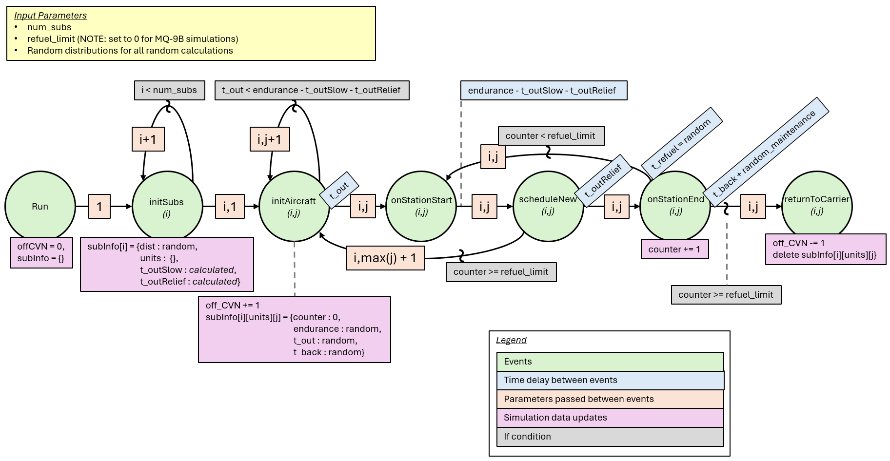
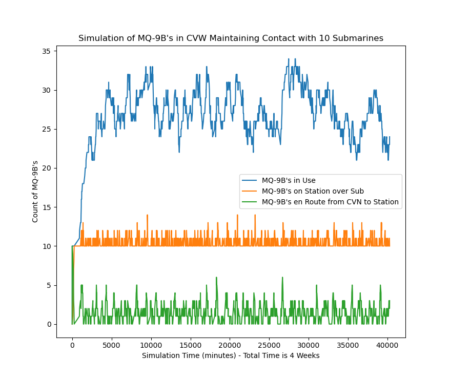
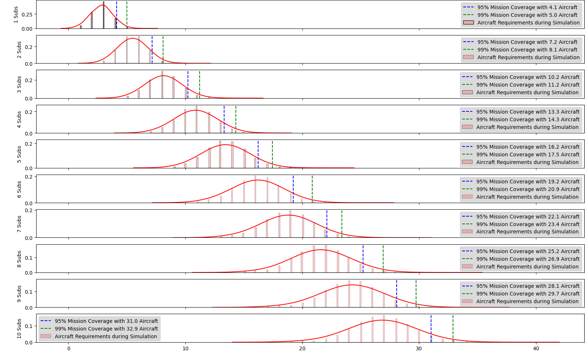

# Purpose

This repository contains the code used by Kurt Pasque to fulfill the white paper final project for OA4602 Joint Campaign Analysis while completing the Operations Research curriculum for Human Resources Officers at the Naval Postgraduate School. White paper pdf is held in this repo, too!

# Project Overview

The project involved modeling carrier operations for anti-submarine warfare to assess how a discrete event simulation could help inform the required number of aircraft on board. The underlying distributions were largely guesses based on unclassified data on the platform being evaluated (the MQ-9B SeaGuardian). 

# Model used

Below is the event graph of the discrete event simulation modeled:

This model visualized more simply is trying to look like this:

# Outputs

Below is the output of 1 replication of 10 submarine contacts:

Below is a large simulation run of 100 replication of the model for 1 through 10 submarines. 

# Notes

The code is relatively messy and un-annotated... sorry!

The code itself contains a DESPy model called `SortyModel` in the `sorties.py` file. The script aptly named `RunSorties.py` contains the input parameters and the simulation execution code. The output is a couple of csv's if `for_report = True`, otherwise just a line graph of each simulation run. 
